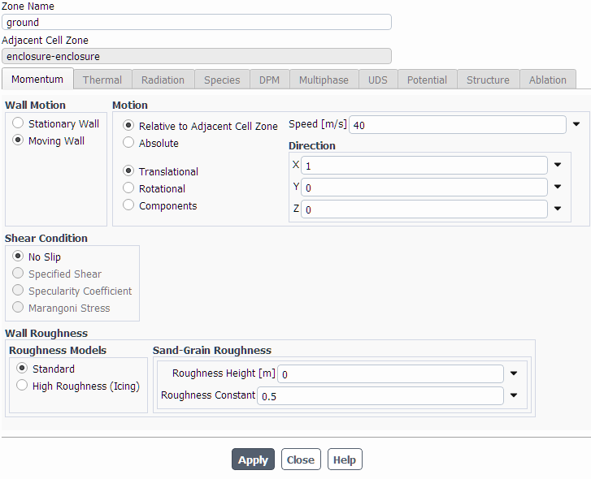
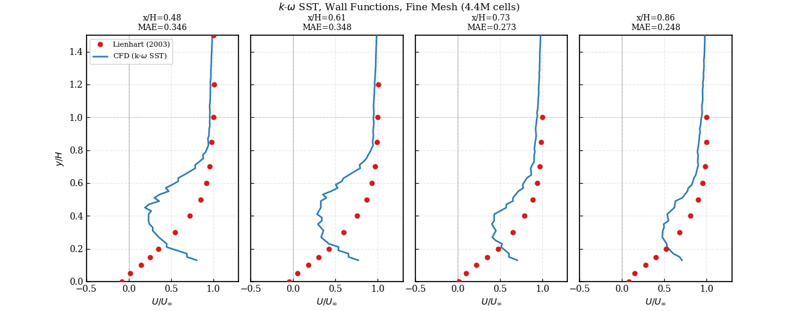

# Ahmed Body CFD Analysis — Mesh Independence & Validation

**25° slant angle | ANSYS Fluent 2024 | k-ω SST | Poly-hexcore | Half model**

**Experimental references.** Two separate sources are used, and they are not interchangeable:
- **Force coefficients** — Meile et al. (2016): `Cd = 0.29883 ± 0.5%` (six-component balance, 40 m/s);
  Meile et al. (2011): `Cl = +0.345`.
- **Wake velocity profiles** — Lienhart & Becker (2003), SAE 2003-01-0656 (LDA). *This paper does not
  report force coefficients and must not be cited for Cd or Cl.*

> ⚠️ **Open issues — see [Known Issues](#known-issues) before using these results.** The computed Cl
> has the wrong sign, and the digitised wake reference data is unverified.

---

## Geometry

Standard Ahmed body: L = 1044 mm, H = 288 mm, W = 389 mm, ground clearance = 50 mm, slant = 25°.  
Half model with symmetry at z = 0.

<p align="center">
  
  
</p>

### Computational Domain

Upstream: 5H | Downstream: 15H | Lateral: 5H | Top: 5H

<p align="center">
  
  
</p>

---

## Mesh

**Tool:** ANSYS Fluent Meshing 2024 — Watertight Geometry workflow, poly-hexcore fill.  
**Boundary layer:** 8 layers, aspect ratio = 40, growth rate = 1.2 → y⁺ ≈ 15–30 (wall functions).

| Parameter | Value |
|-----------|-------|
| Solver | ANSYS Fluent 2024 |
| Mesh type | Poly-hexcore (Watertight Geometry) |
| Turbulence model | k-ω SST |
| Wall treatment | Wall functions (y⁺ ≈ 15–30) |
| BL layers | 8, AR = 40, growth rate 1.2 |
| Inlet velocity | 40 m/s |
| Ground | Moving wall, 40 m/s |
| Symmetry | Half model (z = 0 plane) |

<p align="center">
  
  
  
</p>

<p align="center">
  
  
  
</p>

<p align="center">
  
</p>

---

## Mesh Independence Study

Three mesh levels solved with identical physics settings. GCI per Celik et al. (2008), with the
apparent order `p` solved by fixed-point iteration (the `q(p)` term is retained — the refinement
ratios are non-uniform: r21 = 1.742, r32 = 1.314).

| Mesh | Cells | Cd | GCI (%) | Error vs. raw exp. |
|------|-------|----|---------|--------------------|
| Coarse | 370k | 0.2990 | — | +0.3% |
| Medium | 837k | 0.2800 | 5.25 | −6.0% |
| Fine | 4.4M | 0.2699 | **0.77** | −9.4% |

Richardson-extrapolated Cd = **0.2682** | Apparent order p = **3.53** | Asymptotic range check = **0.96**

> With `p` fixed at the theoretical 2nd order: Cd_ext = 0.2649, GCI_fine = 2.30% — same conclusion.
> The fine-mesh numerical uncertainty (<1%) is an order of magnitude smaller than the deviation
> from experiment, so the residual error is **modelling error, not discretisation error**.

### Stilt correction — the like-for-like comparison

The experimental model sits on four support stilts. **This CFD model has none**, so comparing it
directly against the measured 0.298 charges it with drag it never generated. Gutierrez et al. (2020,
Table 3) decompose drag by surface and give the stilt contribution as ΔCd = 0.0158 (RSM) to 0.0245
(k-ω Standard):

| Reference | Cd | Fine-mesh error |
|---|---|---|
| Raw measured (with stilts) | 0.298 | −9.4% |
| **Stilt-corrected (stilt-free)** | **0.2735 – 0.2822** | **−1.3% to −4.4%** |

The coarse mesh looks almost exact against the raw value (+0.3%) purely through compensating
errors — excess numerical diffusion inflates its drag, offsetting both the model's underprediction
and the missing stilt drag. Agreement on an unconverged mesh is not evidence of a correct solution.

<p align="center">
  
</p>

---

## Results

### Coarse Mesh (370k cells — Cd = 0.299)

<p align="center">
  
</p>

### Medium Mesh (837k cells — Cd = 0.280)

<p align="center">
  
</p>

### Fine Mesh (4.4M cells — Cd = 0.270)

<p align="center">
  
  
</p>

---

## Validation vs. Lienhart & Becker (2003)

| | CFD (fine mesh) | Experiment | Error |
|-|----------------|------------|-------|
| Cd (vs. stilt-corrected ref.) | 0.2699 | 0.2735 – 0.2822 | **−1.3% to −4.4%** |
| Cl | −0.323 ⚠️ | +0.345 (Meile 2011) | **sign error — see below** |

> Cd underprediction is consistent with known k-ω SST + wall function limitations for separated
> bluff-body aerodynamics. Crucially, the fine-mesh GCI is 0.77% — the solution *is* mesh
> independent, so the residual deviation is model error, not a resolution problem.

---

## Known Issues

**1. Cl has the wrong sign — do not use this value.**
The experimental Cl for a 25° slant is **positive** (+0.345, Meile et al. 2011; Gutierrez et al.
2020 obtain +0.363 and +0.376 with k-ε Realizable and k-ω Standard). Physically, the slow flow
between road and underbody keeps the underbody pressure higher than the upper-surface pressure,
producing net positive lift.

This simulation returns **−0.323** — nearly the right magnitude with the opposite sign. That
pattern points to a **direction-vector error in the Fluent lift report definition**, not a physics
problem: a genuine modelling deficiency would not reproduce the magnitude so closely. The lift
direction vector needs to be verified against the geometry's vertical axis. Until then, no physical
interpretation of the negative Cl is offered here, because the most likely explanation is a
post-processing error.

**2. Wake reference data is unverified.**
The experimental profiles in `scripts/lienhart_comparison.py` were entered manually as digitised
values and have **not** been checked against the source dataset (ERCOFTAC Classic Collection,
Case C.81). The wake comparison and any error metric derived from it are provisional until that
check is done.

### Wake Velocity Profiles

Streamwise velocity at x/H = 0.48, 0.61, 0.73, 0.86 downstream of body rear.  
Red circles: Lienhart (2003) experimental data. Blue line: CFD k-ω SST.

<p align="center">
  
</p>

---

## Scripts

| Script | Purpose |
|--------|---------|
| `scripts/y_plus_calculator.py` | First cell height for target y⁺ |
| `scripts/mesh_independence.py` | GCI calculation + convergence plot → `report/figures/mesh_independence.pdf` |
| `scripts/lienhart_comparison.py` | Wake profile validation → `report/figures/velocity_profiles.pdf` |

```bash
python scripts/y_plus_calculator.py
python scripts/mesh_independence.py
python scripts/lienhart_comparison.py   # requires results/fine/velocity_profiles.xy
```

---

## Repository Structure

```
ahmed-body-cfd/
├── geometry/
│   ├── ahmed_body_isometric.png
│   ├── ahmed_body_side.png
│   ├── domain_rear_dimensions.png
│   └── domain_overview.png
├── mesh/
│   └── screenshots/          # Fluent Meshing workflow, BL settings, surface mesh
├── results/
│   ├── coarse/               # Cd = 0.299
│   ├── medium/               # Cd = 0.280
│   └── fine/
│       ├── velocity_profiles.xy
│       └── screenshots/      # Convergence, Cd/Cl, post-processing
├── scripts/
│   ├── y_plus_calculator.py
│   ├── mesh_independence.py
│   └── lienhart_comparison.py
└── report/
    ├── main.tex
    └── figures/
        ├── mesh_independence.pdf
        └── velocity_profiles.pdf
```

---

## References

- **Lienhart, H. & Becker, S. (2003).** *Flow and turbulence structure in the wake of a simplified car model.* SAE 2003-01-0656. — LDA wake velocity profiles. **Does not report force coefficients.**
- **Meile, W., Brenn, G., Reppenhagen, A. & Fuchs, A. (2011).** *Experiments and numerical simulations on the aerodynamics of the Ahmed body.* CFD Letters, 3(1), 32–39. — Cl = +0.345.
- **Meile, W., Ladinek, T., Brenn, G., Reppenhagen, A. & Fuchs, A. (2016).** *Non-symmetric bi-stable flow around the Ahmed body.* Int. J. Heat and Fluid Flow, 57, 34–47. — Cd = 0.29883 ± 0.5%.
- **Chavez Gutierrez, J.E., Vera Duarte, L.E., Oliveira Jr., A.A.M. & Cancino, L.R. (2020).** *The Ahmed body's external aerodynamics at 25° slant angle rear surface.* ENCIT 2020, ENC-2020-0060. — Surface-by-surface drag/lift decomposition (stilt contribution).
- **Celik, I.B. et al. (2008).** *Procedure for estimation and reporting of uncertainty due to discretization in CFD applications.* J. Fluids Eng., 130(7), 078001. — GCI methodology.
- **Ahmed, S.R., Ramm, G. & Faltin, G. (1984).** *Some salient features of the time-averaged ground vehicle wake.* SAE 840300.
