# Ahmed Body CFD Analysis — Mesh Independence & Validation

**25° slant angle | ANSYS Fluent 2024 | k-ω SST | Poly-hexcore | Half model**

**Experimental references.** Two separate sources are used, and they are not interchangeable:
- **Force coefficients** — Meile et al. (2016): `Cd = 0.29883 ± 0.5%` (six-component balance, 40 m/s);
  Meile et al. (2011): `Cl = +0.345`.
- **Wake velocity profiles** — Lienhart & Becker (2003), SAE 2003-01-0656 (LDA). *This paper does not
  report force coefficients and must not be cited for Cd or Cl.*

> ⚠️ **Open issues — see [Known Issues](#known-issues) before using these results.** The wake
> comparison has been withdrawn pending re-export of the CFD profiles at the correct experimental
> stations, and the CFD runs on a moving ground while both experiments used a stationary floor — so
> the Cl comparison is not like-for-like. *(The Cl sign inversion has been resolved.)*

---

## Geometry

Standard Ahmed body: L = 1044 mm, H = 288 mm, W = 389 mm, ground clearance = 50 mm, slant = 25°.  
Half model with symmetry at z = 0.

<p align="center">
  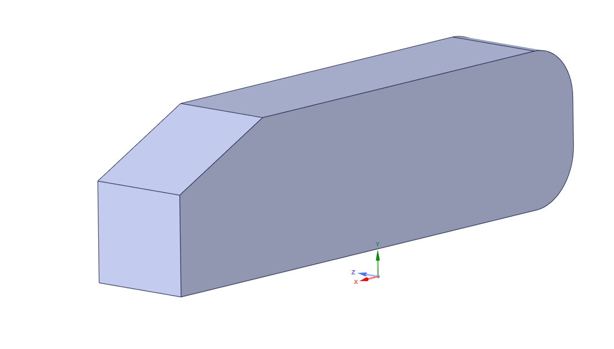
  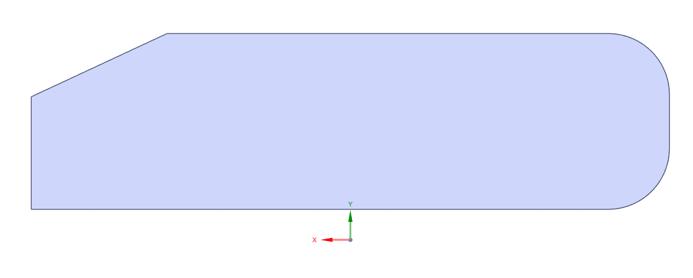
</p>

### Computational Domain

Upstream: 5H | Downstream: 15H | Lateral: 5H | Top: 5H

<p align="center">
  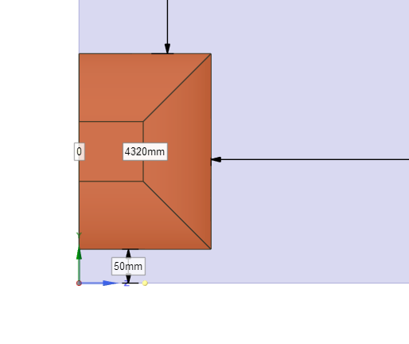
  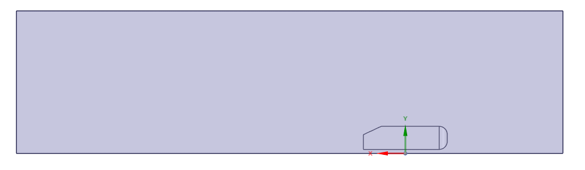
</p>

---

## Mesh

**Tool:** ANSYS Fluent Meshing 2024 — Watertight Geometry workflow, poly-hexcore fill.  
**Boundary layer:** 8 layers, aspect ratio = 40, growth rate = 1.2 → y⁺ ≈ 15–30 (wall functions).

| Parameter | Value |
|-----------|-------|
| Solver | ANSYS Fluent 2024 |
| Mesh type | Poly-hexcore (Watertight Geometry) |
| Turbulence model | k-ω SST |
| Wall treatment | Wall functions (y⁺ ≈ 15–30) |
| BL layers | 8, AR = 40, growth rate 1.2 |
| Inlet velocity | 40 m/s |
| Ground | Moving wall, 40 m/s ⚠️ (experiments used a stationary floor — [issue 3](#known-issues)) |
| Symmetry | Half model (z = 0 plane) |

<p align="center">
  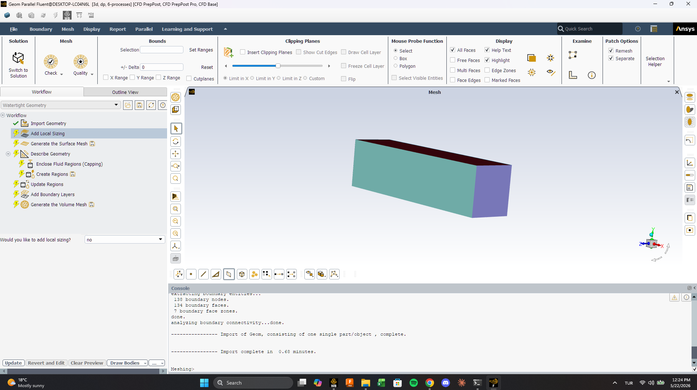
  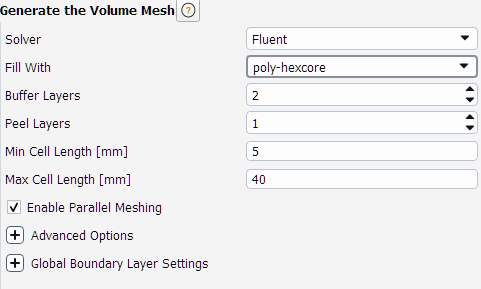
  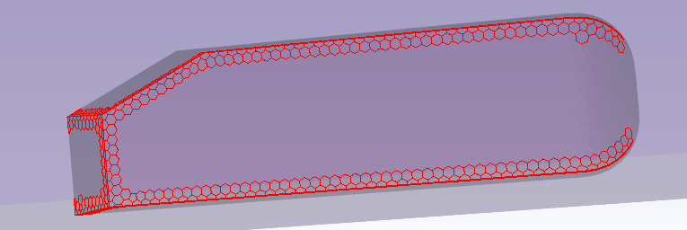
</p>

<p align="center">
  
  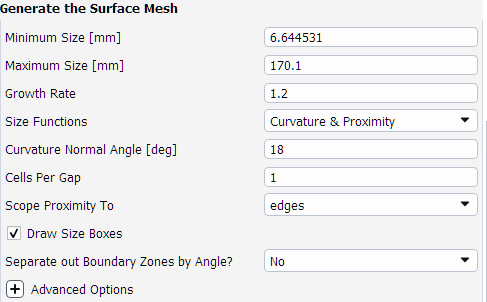
  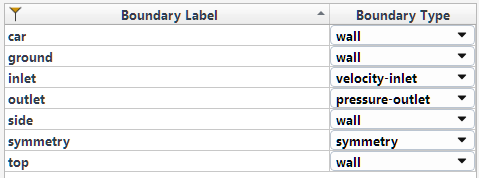
</p>

<p align="center">
  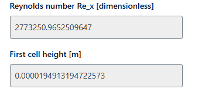
</p>

### Mesh Quality

Reported by Fluent (`/mesh/quality`) on the volume mesh:

| Metric | Medium (837k) | Fine (4.4M) | Acceptable |
|---|---|---|---|
| Min orthogonal quality | 0.1637 | 0.1537 | > 0.01 required, > 0.1 good |
| Max aspect ratio | 122.7 | 122.2 | High values expected in prism layers |

Both meshes locate their worst cell at essentially the same place — medium at
`(0.522, 0.059, 0.186)`, fine at `(0.518, 0.050, 0.190)`, both in zone 308 — and in each case the
worst orthogonal-quality cell *is* the worst-skewness cell, with the worst aspect-ratio cell a
fraction of a millimetre away. The poor cells are therefore a single localised cluster at the
prism-layer/hexcore transition rather than a distributed quality problem, and refining the mesh did
not spread them. Given GCI_fine = 0.77%, they do not measurably affect the solution.

> Aspect ratio ~122 against a target first-layer AR of 40 is normal: the target governs the first
> layer, while the reported maximum is taken over the whole boundary-layer stack.

---

## Mesh Independence Study

Three mesh levels solved with identical physics settings. GCI per Celik et al. (2008), with the
apparent order `p` solved by fixed-point iteration (the `q(p)` term is retained — the refinement
ratios are non-uniform: r21 = 1.742, r32 = 1.314).

| Mesh | Cells | Cd | GCI (%) | Error vs. raw exp. |
|------|-------|----|---------|--------------------|
| Coarse | 370k | 0.2990 | — | +0.3% |
| Medium | 837k | 0.2800 | 5.25 | −6.0% |
| Fine | 4.4M | 0.2699 | **0.77** | −9.4% |

Richardson-extrapolated Cd = **0.2682** | Apparent order p = **3.53** | Asymptotic range check = **0.96**

> With `p` fixed at the theoretical 2nd order: Cd_ext = 0.2649, GCI_fine = 2.30% — same conclusion.
> The fine-mesh numerical uncertainty (<1%) is an order of magnitude smaller than the deviation
> from experiment, so the residual error is **modelling error, not discretisation error**.

### Stilt correction — the like-for-like comparison

The experimental model sits on four support stilts. **This CFD model has none**, so comparing it
directly against the measured 0.298 charges it with drag it never generated. Gutierrez et al. (2020,
Table 3) decompose drag by surface and give the stilt contribution as ΔCd = 0.0158 (RSM) to 0.0245
(k-ω Standard):

| Reference | Cd | Fine-mesh error |
|---|---|---|
| Raw measured (with stilts) | 0.298 | −9.4% |
| **Stilt-corrected (stilt-free)** | **0.2735 – 0.2822** | **−1.3% to −4.4%** |

The coarse mesh looks almost exact against the raw value (+0.3%) purely through compensating
errors — excess numerical diffusion inflates its drag, offsetting both the model's underprediction
and the missing stilt drag. Agreement on an unconverged mesh is not evidence of a correct solution.

<p align="center">
  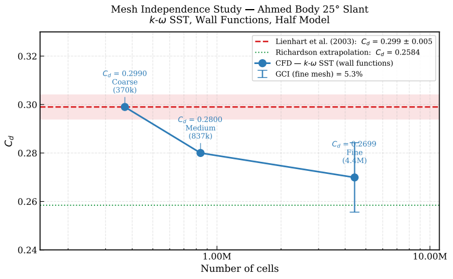
</p>

---

## Results

### Coarse Mesh (370k cells — Cd = 0.299, Cl = **+0.3357**)

This run had the correct lift force vector from the start; the medium and fine cases did not, which
is how the sign error in [issue 1](#known-issues) was caught.

<p align="center">
  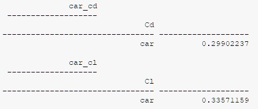
</p>

### Medium Mesh (837k cells — Cd = 0.280, Cl = **+0.32349** sign-corrected)

<p align="center">
  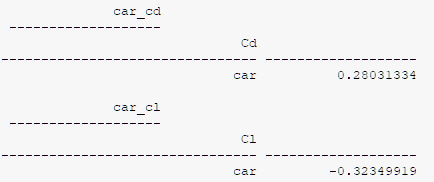
</p>

### Fine Mesh (4.4M cells — Cd = 0.270, Cl = **+0.32319** sign-corrected)

<p align="center">
  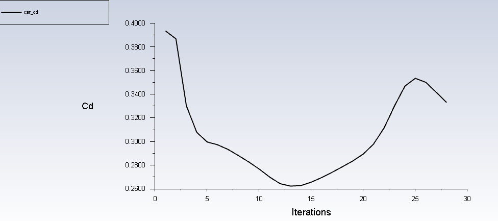
  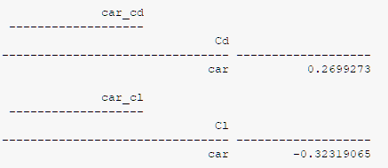
</p>

---

## Validation vs. Experiment

| | CFD (fine mesh) | Experiment | Error |
|-|----------------|------------|-------|
| Cd (vs. stilt-corrected ref.) | 0.2699 | 0.2735 – 0.2822 | **−1.3% to −4.4%** |
| Cl (sign-corrected) | +0.32319 | +0.345 (Meile 2011) | **−6.3%** ⚠️ not like-for-like |

> Cd underprediction is consistent with known k-ω SST + wall function limitations for separated
> bluff-body aerodynamics. Crucially, the fine-mesh GCI is 0.77% — the solution *is* mesh
> independent, so the residual deviation is model error, not a resolution problem.
>
> The Cl sign error has been fixed (issue 1), but the comparison remains **moving-ground CFD against
> fixed-ground experiment** (issue 3), so the −6.3% is not a clean validation figure.

---

## Known Issues

**1. Cl sign inversion — ✅ RESOLVED.**
The experimental Cl for a 25° slant is **positive** (+0.345, Meile et al. 2011; Gutierrez et al.
2020 obtain +0.363 and +0.376). Physically, the slow flow between road and underbody keeps the
underbody pressure higher than the upper-surface pressure, producing net positive lift. The medium
and fine meshes originally reported a *negative* Cl of the same magnitude.

**Cause:** the lift report definition's force vector had been set to `(0, −1, 0)` on the medium and
fine cases, against `(0, 1, 0)` on the coarse case — the vertical axis entered with the wrong sign
between the coarse and medium runs. A post-processing error, not a physical one, exactly as the
magnitude agreement predicted.

**Fix:** the force vector was corrected to `(0, 1, 0)` and Cl re-extracted from the existing
converged solutions. No re-iteration was needed, so the flow fields are unchanged.

| Mesh | Cl (as-reported) | Cl (corrected) | Deviation from exp. |
|---|---|---|---|
| Coarse (370k) | +0.3357 | +0.3357 *(was already correct)* | −2.7% |
| Medium (837k) | −0.3235 | **+0.32349** | −6.2% |
| Fine (4.4M) | −0.3232 | **+0.32319** | −6.3% |

The corrected magnitudes match the originals to five significant figures — confirming the sign was
the only defect. All three meshes now agree on both sign and magnitude.

> ⚠️ **This does not by itself validate Cl.** The corrected +0.323 is a *moving-ground* result being
> compared against a *fixed-ground* measurement — see issue 3. The −6.3% residual is not yet
> attributable to turbulence modelling.

**2. The wake comparison was withdrawn (not corrected).**
An earlier revision plotted CFD wake profiles against a hand-entered "Lienhart & Becker" table at
stations x/H = 0.48, 0.61, 0.73, 0.86. Checking against the real source — **ERCOFTAC Classic
Collection, [Case 082](http://cfd.mace.manchester.ac.uk/ercoftac/doku.php?id=cases:case082)** —
showed two problems:

- Those stations **do not exist** in the experiment. The measured planes are at x = 0, 80, 200,
  500 mm (x/H = 0, 0.28, 0.69, 1.74). The tabulated values didn't match the real data either: the
  experiment shows reverse flow reaching **U/U∞ = −0.34** at x = 80 mm, an order of magnitude
  stronger than what had been tabulated.
- The Fluent export (`results/fine/velocity_profiles.xy`) labels its blocks `wake_x1`–`wake_x4` and
  **records no streamwise coordinate**, so the computed profiles cannot be located either.

Fixing the reference alone wouldn't have made the comparison valid, so it was removed. The genuine
ERCOFTAC data is now in `data/ercoftac/` and `scripts/ercoftac_wake_reference.py` reads it directly.
**Next step:** re-export the CFD symmetry-plane profiles at the four experimental stations.

**3. The ground boundary condition does not match either experiment.**
This CFD uses a **moving wall at 40 m/s** to emulate a rolling road. Both experimental sources used
here ran on a **stationary floor**:

| Source | Facility | Ground |
|---|---|---|
| Lienhart & Becker (ERCOFTAC 082) | LSTM, 3/4-open test section | Fixed ground plate; model on 30 mm stilts through the plate, 50 mm clearance |
| Meile et al. (2011, 2016) | Graz ISW | Fixed floor, six-component balance |

This is not a cosmetic difference. Strachan et al. (2007) measured the same geometry over both a
fixed and a moving ground and found the moving plane thins the underbody boundary layer, raises
underbody flow speed, and shifts the near-wake vortex structure — which acts directly on the
underbody pressure that sets **Cl**, the very coefficient flagged in issue 1.

So the Cl comparison in this README is **not like-for-like**, in addition to the sign problem: the
sign-corrected +0.323 against Meile's +0.345 mixes a moving-ground CFD with a fixed-ground
measurement. The residual −6.3% cannot be attributed to turbulence modelling until the ground
condition is matched. (SimFlow's stationary-ground reference case for this geometry reports
Cl = +0.355, i.e. the gap narrows in the direction this argument predicts.) Cd is less sensitive but
not immune.

**Action:** rerun the fine mesh with the ground set to a stationary wall, restarting from the
converged moving-ground solution and changing nothing else, then report both.

### Experimental Wake Reference

The genuine Lienhart & Becker wake measurements (ERCOFTAC Case 082) are included in
`data/ercoftac/`, unmodified. Measurement planes: x = 0, 80, 200, 500 mm behind the body.
A CFD comparison against them is the next step — see [Known Issues](#known-issues).

---

## Scripts

| Script | Purpose |
|--------|---------|
| `scripts/y_plus_calculator.py` | First cell height for target y⁺ |
| `scripts/mesh_independence.py` | GCI calculation + convergence plot → `report/figures/mesh_independence.pdf` |
| `scripts/ercoftac_wake_reference.py` | Plots the experimental wake reference from `data/ercoftac/` (ERCOFTAC Case 082) |

```bash
python scripts/y_plus_calculator.py
python scripts/mesh_independence.py
python scripts/ercoftac_wake_reference.py
```

---

## Repository Structure

```
ahmed-body-cfd/
├── geometry/
│   ├── ahmed_body_isometric.png
│   ├── ahmed_body_side.png
│   ├── domain_rear_dimensions.png
│   └── domain_overview.png
├── mesh/
│   └── screenshots/          # Fluent Meshing workflow, BL settings, surface mesh
├── results/
│   ├── coarse/               # Cd = 0.299
│   ├── medium/               # Cd = 0.280
│   └── fine/
│       ├── velocity_profiles.xy
│       └── screenshots/      # Convergence, Cd/Cl, post-processing
├── scripts/
│   ├── y_plus_calculator.py
│   ├── mesh_independence.py
│   └── ercoftac_wake_reference.py
├── data/
│   └── ercoftac/             # ERCOFTAC Case 082 experimental data (unmodified)
└── report/
    ├── main.tex
    └── figures/
        ├── mesh_independence.pdf
        └── velocity_profiles.pdf
```

---

## References

- **Lienhart, H. & Becker, S. (2003).** *Flow and turbulence structure in the wake of a simplified car model.* SAE 2003-01-0656. — LDA wake velocity profiles. **Does not report force coefficients.**
- **Meile, W., Brenn, G., Reppenhagen, A. & Fuchs, A. (2011).** *Experiments and numerical simulations on the aerodynamics of the Ahmed body.* CFD Letters, 3(1), 32–39. — Cl = +0.345.
- **Meile, W., Ladinek, T., Brenn, G., Reppenhagen, A. & Fuchs, A. (2016).** *Non-symmetric bi-stable flow around the Ahmed body.* Int. J. Heat and Fluid Flow, 57, 34–47. — Cd = 0.29883 ± 0.5%.
- **Chavez Gutierrez, J.E., Vera Duarte, L.E., Oliveira Jr., A.A.M. & Cancino, L.R. (2020).** *The Ahmed body's external aerodynamics at 25° slant angle rear surface.* ENCIT 2020, ENC-2020-0060. — Surface-by-surface drag/lift decomposition (stilt contribution).
- **Strachan, R.K., Knowles, K. & Lawson, N.J. (2007).** *The vortex structure behind an Ahmed reference model in the presence of a moving ground plane.* Experiments in Fluids, 42(5), 659–669. — Moving vs. fixed ground effect on underbody flow and wake vortices.
- **Celik, I.B. et al. (2008).** *Procedure for estimation and reporting of uncertainty due to discretization in CFD applications.* J. Fluids Eng., 130(7), 078001. — GCI methodology.
- **Ahmed, S.R., Ramm, G. & Faltin, G. (1984).** *Some salient features of the time-averaged ground vehicle wake.* SAE 840300.
